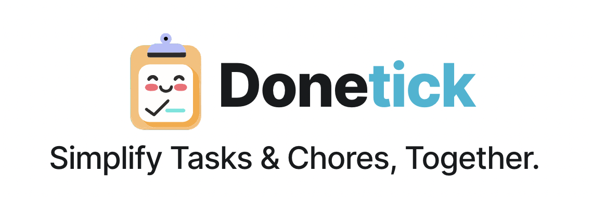

# Welcome to the Donetick!

Donetick is an open-source, user-friendly app designed to help individuals and groups manage tasks and chores efficiently.

# Donetick Hosted :
For those who prefer not to self-host, Donetick is also available as a hosted service. This version is maintained and hosted by Donetick at [donetick.com](https://donetick.com), offering the same great features without the need for personal server management. Visit the website to learn more and get started.

## About Donetick
Donetick is an open-source task and chore management app designed for flexible task assignment and advanced scheduling. Easily share tasks with others, keep some private, and track your entire task history long-term.

## Why Build Donetick
This personal project was born out of the desire for an app that could handle complex task schedules with personalized notifications ( telegram notification) for specific group or person who can perform a task/chore. Donetick lets you track a detailed history with notes, perfect for household chores like AC maintenance or water filter replacements. Easily reference past work, track frequencies, and even get basic predictions for when tasks might be due again.

it's built with an emphasis on user-friendliness, ensuring that even those with limited tech experience can easily navigate and utilize its features, including the convenient NFC tag scanning for quick task completion.

## Features:
- **Task and Chore Management**: Create, edit, and manage tasks and chores with ease.
- **Shared To-Do Lists**: Collaborate on tasks with family or groups through "Circles".
- **Assignee Assignment**: Assign tasks to individuals or rotate them automatically.
- **Recurring Tasks**: Schedule tasks to repeat at customizable intervals.
- **Progress Tracking**: Keep track of task completion and view historical data.
- **Things** a way to track and interact with 3rd party, track a numeric, string, boolean value and have tasks become due upon state being met
